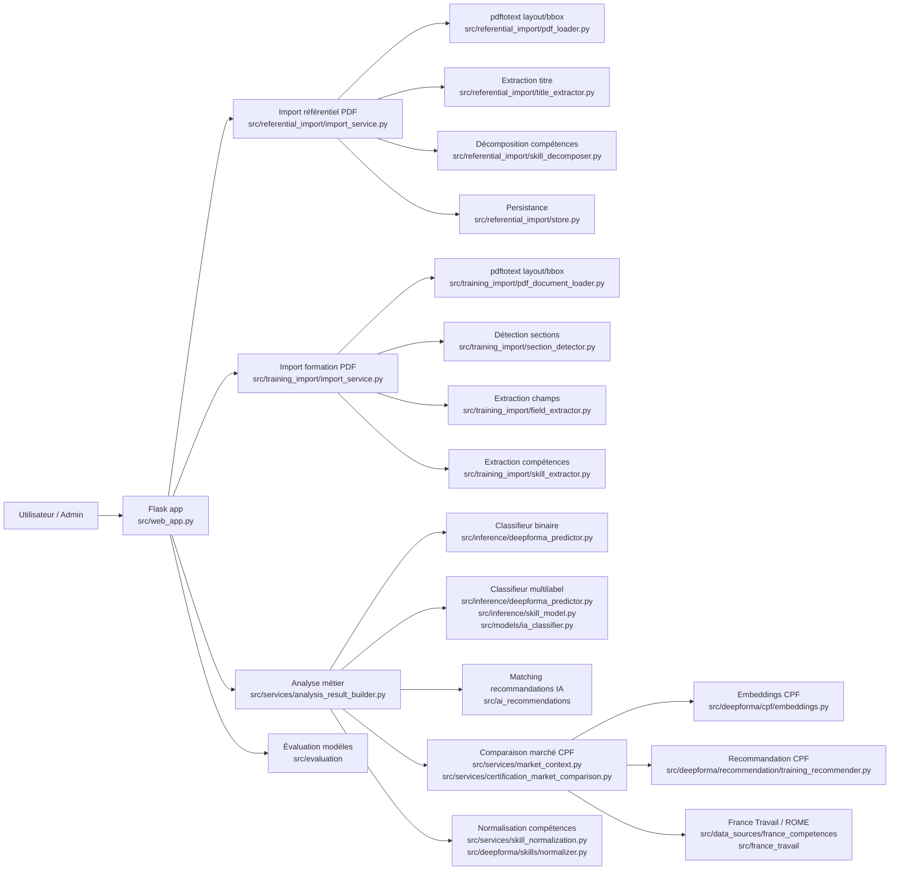

# Architecture complète DeepForma

Ce document inventorie l'architecture réellement présente dans le dépôt et relie les responsabilités aux chemins source.

## Vue d'ensemble

L'application Flask est centralisée dans [`src/web_app.py`](../src/web_app.py) avec un assemblage par service et par modèle.
Le flux métier principal observé dans le code est:

`document ou profil -> extraction -> normalisation -> comparaison marché -> détection des écarts -> recommandation -> explication`

Les couches principales sont:

- `src/domain`: objets métiers, règles de matching et exceptions.
- `src/services`: orchestration métier, comparaison marché, normalisation et construction de résultats.
- `src/data_sources`: chargement et nettoyage de sources externes et de datasets.
- `src/deepforma`: utilitaires de préparation, entraînement et recommandation CPF.
- `src/inference`: wrappers d'inférence pour les modèles réellement utilisés.
- `src/models`: wrappers de modèles et objets de sortie sérialisables.
- `src/referential_import`: import PDF des référentiels de certification.
- `src/training_import`: import PDF des formations et préparation des données.
- `src/referential_learning`: pipeline ML optionnel pour l'enrichissement des référentiels.
- `src/referentials`: référentiels métier, RNCP/ROME et enrichissement d'offres.
- `scripts`: entraînement, évaluation, import, audit, déploiement.

## Diagramme applicatif

## Flux applicatif réel

### Analyse d'un document

- [`src/web_app.py`](../src/web_app.py) appelle [`build_analysis_result`](../src/services/analysis_result_builder.py).
- Le service s'appuie sur [`src/inference/deepforma_predictor.py`](../src/inference/deepforma_predictor.py) pour:
  - le classifieur binaire IA / non-IA;
  - le classifieur multilabel de compétences IA.
- Les compétences extraites sont normalisées par [`src/services/skill_normalization.py`](../src/services/skill_normalization.py) et [`src/deepforma/skills/normalizer.py`](../src/deepforma/skills/normalizer.py).
- La comparaison marché est orchestrée via [`src/services/market_context.py`](../src/services/market_context.py) puis [`src/services/certification_market_comparison.py`](../src/services/certification_market_comparison.py).
- Les recommandations CPF sont calculées par [`src/deepforma/recommendation/training_recommender.py`](../src/deepforma/recommendation/training_recommender.py).
- Les recommandations IA hybrides sont produites par [`src/ai_recommendations/matcher.py`](../src/ai_recommendations/matcher.py) puis fusionnées par [`src/ai_recommendations/fusion.py`](../src/ai_recommendations/fusion.py).

### Import référentiel PDF

- [`src/referential_import/import_service.py`](../src/referential_import/import_service.py) charge le PDF via [`pdf_loader.py`](../src/referential_import/pdf_loader.py).
- L'intitulé est détecté par [`title_extractor.py`](../src/referential_import/title_extractor.py).
- Les compétences et critères sont extraits par [`competency_parser.py`](../src/referential_import/competency_parser.py) et [`skill_decomposer.py`](../src/referential_import/skill_decomposer.py).
- La couche ML optionnelle provient de [`src/referential_learning/pipeline.py`](../src/referential_learning/pipeline.py) et reste conditionnée par des variables d'environnement.
- La persistance passe par [`store.py`](../src/referential_import/store.py).

### Import formation PDF

- [`src/training_import/import_service.py`](../src/training_import/import_service.py) charge le PDF avec [`pdf_document_loader.py`](../src/training_import/pdf_document_loader.py).
- Le profil de document est détecté par [`document_profile_classifier.py`](../src/training_import/document_profile_classifier.py).
- Les sections sont détectées par [`section_detector.py`](../src/training_import/section_detector.py).
- Les champs métier sont extraits par [`field_extractor.py`](../src/training_import/field_extractor.py).
- Les compétences sont extraites par [`skill_extractor.py`](../src/training_import/skill_extractor.py).

## Points de sortie admin

- `/admin/referential-import` dans [`src/web_app.py`](../src/web_app.py).
- `/admin/model-evaluation` dans [`src/web_app.py`](../src/web_app.py).
- `/admin/ai-recommendation-rules` dans [`src/web_app.py`](../src/web_app.py).
- `/admin/ai-certification-market-comparison` dans [`src/web_app.py`](../src/web_app.py).

## Observations importantes

- Le chargement de modèles lourds est évité côté page admin d'évaluation: les artefacts JSON/CSV sont lus depuis `artifacts/evaluations/*`.
- Les recommandations IA sont pilotées par règles, index sémantique et fusion de scores, pas par un nouveau classifieur autonome.
- Le pipeline référentiel ML est optionnel: les fonctions `_load_section_model`, `_load_ner_model` et `_load_multilabel_model` dans [`src/referential_learning/pipeline.py`](../src/referential_learning/pipeline.py) ne chargent des poids que si les variables d'environnement l'autorisent et si les chemins existent.
