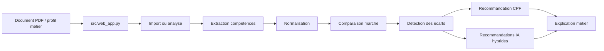
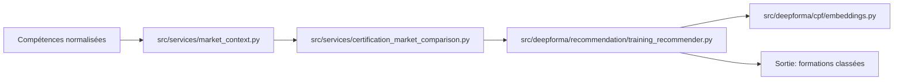
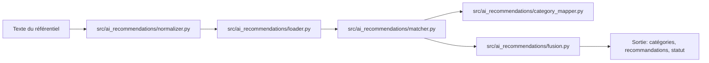

# Flux d'inférence

## Flux réel document / profil

## Analyse d'un document référentiel PDF

1. [`src/web_app.py`](../src/web_app.py) appelle [`src/referential_import/import_service.py`](../src/referential_import/import_service.py).
2. [`load_pdf_document`](../src/referential_import/pdf_loader.py) tente d'abord `pdftotext -bbox-layout`, puis bascule en `pdftotext -layout` si nécessaire.
3. [`extract_referential_title`](../src/referential_import/title_extractor.py) produit:
   - `document_title`
   - `certification_title`
   - `target_job_title`
   - `rncp_code`
4. [`parse_competency_and_criteria_lines`](../src/referential_import/competency_parser.py) et [`decompose_competency`](../src/referential_import/skill_decomposer.py) structurent les blocs et critères.
5. Une couche ML optionnelle peut enrichir l'analyse via [`src/referential_learning/pipeline.py`](../src/referential_learning/pipeline.py) si les variables d'environnement l'autorisent.
6. L'import est persisté dans [`src/referential_import/store.py`](../src/referential_import/store.py).

## Analyse d'une formation / d'un profil

1. [`src/training_import/import_service.py`](../src/training_import/import_service.py) charge le PDF.
2. [`document_profile_classifier.py`](../src/training_import/document_profile_classifier.py) estime le profil de mise en page.
3. [`section_detector.py`](../src/training_import/section_detector.py) et [`field_extractor.py`](../src/training_import/field_extractor.py) identifient les sections et champs.
4. [`skill_extractor.py`](../src/training_import/skill_extractor.py) extrait les compétences.
5. Les compétences sont normalisées par [`src/deepforma/skills/normalizer.py`](../src/deepforma/skills/normalizer.py).

## Comparaison marché / recommandation CPF

- [`build_market_context`](../src/services/market_context.py) prépare le contexte et appelle [`RecommendationService.compare`](../src/services/recommendation_service.py).
- [`RecommendationService`](../src/services/recommendation_service.py) calcule une couverture des compétences du profil par rapport au marché.
- [`TrainingRecommender`](../src/deepforma/recommendation/training_recommender.py) combine:
  - couverture de compétences;
  - similarité sémantique;
  - score territoire;
  - niveau de certification;
  - qualité des métadonnées.
- Les embeddings sont produits par [`src/deepforma/cpf/embeddings.py`](../src/deepforma/cpf/embeddings.py) et peuvent utiliser FAISS si disponible.

## Recommandations IA hybrides

- `src/ai_recommendations/loader.py` charge le CSV / JSON des règles.
- `src/ai_recommendations/normalizer.py` normalise les mots-clés.
- `src/ai_recommendations/matcher.py` gère la correspondance exacte, lexicale puis sémantique.
- `src/ai_recommendations/category_mapper.py` mappe les règles vers la taxonomie IA.
- `src/ai_recommendations/fusion.py` neutralise le poids du modèle multilabel quand il est non discriminant.
- `src/ai_recommendations/semantic_index.py` maintient l'index vectoriel des règles.

## Routes admin pertinentes

- `/admin/model-evaluation` lit les artefacts dans `artifacts/evaluations/<model>/<run>/`.
- `/admin/ai-recommendation-rules` charge les règles IA normalisées.
- `/admin/referential-import` affiche le résultat d'import PDF et le titre extrait.
- `/admin/ai-certification-market-comparison` affiche la comparaison marché pour un référentiel.
