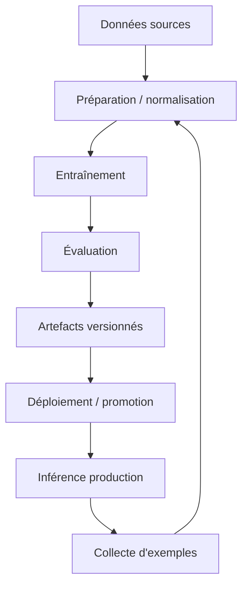

# Flux d'entraînement

## Cycle global

## Classifieur binaire et multilabel IA

- Préparation des données historiques: [`scripts/prepare_ia_training_dataset.py`](../scripts/prepare_ia_training_dataset.py).
- Entraînement multilabel historique: [`scripts/train_multilabel.py`](../scripts/train_multilabel.py).
- Variante multi-label plus récente: [`scripts/train_ia_multilabel_classifier.py`](../scripts/train_ia_multilabel_classifier.py).
- Évaluation multilabel: [`scripts/evaluate_ia_multilabel_classifier.py`](../scripts/evaluate_ia_multilabel_classifier.py).
- Audit de checkpoint: [`scripts/audit_multilabel_checkpoint.py`](../scripts/audit_multilabel_checkpoint.py).

Le dépôt contient aussi un notebook générateur historique [`scripts/build_notebook_v2.py`](../scripts/build_notebook_v2.py) qui documente l'origine des checkpoints `binary_ia_v2` et `multilabel_competences_v2`.

## CPF recommender

- Préparation du dataset: [`src/deepforma/training/cpf_dataset.py`](../src/deepforma/training/cpf_dataset.py).
- Entraînement: [`scripts/train_cpf_recommender.py`](../scripts/train_cpf_recommender.py).
- Export d'embeddings: [`scripts/build_cpf_embeddings.py`](../scripts/build_cpf_embeddings.py).
- Évaluation: [`scripts/evaluate_cpf_recommender.py`](../scripts/evaluate_cpf_recommender.py).
- Utilisation d'inférence: [`src/deepforma/recommendation/training_recommender.py`](../src/deepforma/recommendation/training_recommender.py).

Le manifest d'entraînement conservé dans [`models/cpf-recommender/training_manifest.json`](../models/cpf-recommender/training_manifest.json) indique:

- base model: `sentence-transformers/paraphrase-multilingual-MiniLM-L12-v2`
- loss: `MultipleNegativesRankingLoss`
- métriques de validation: recall@k, MRR, NDCG

## Extracteur de compétences en continual learning

- Entraînement historique: [`scripts/train_skill_extractor.py`](../scripts/train_skill_extractor.py).
- Entraînement continu: [`scripts/train_continual_skill_extractor.py`](../scripts/train_continual_skill_extractor.py).
- Comparaison de versions: [`scripts/compare_model_versions.py`](../scripts/compare_model_versions.py).
- Promotion / rollback: [`scripts/promote_continual_model.py`](../scripts/promote_continual_model.py), [`scripts/rollback_continual_model.py`](../scripts/rollback_continual_model.py).
- Orchestration: [`scripts/orchestrate_continual_learning.py`](../scripts/orchestrate_continual_learning.py).
- Registre: [`src/continual_learning/model_registry.py`](../src/continual_learning/model_registry.py).

Le stockage principal est `models/skill-extractor/` avec `registry.json`, `versions/` et un lien `production`.

## Modèles référentiels

- Classifieur de sections: [`scripts/train_referential_section_classifier.py`](../scripts/train_referential_section_classifier.py).
- NER référentiel: [`scripts/train_referential_skill_ner.py`](../scripts/train_referential_skill_ner.py).
- Multilabel référentiel: [`scripts/train_referential_multilabel.py`](../scripts/train_referential_multilabel.py).
- Évaluation conjointe: [`scripts/evaluate_referential_models.py`](../scripts/evaluate_referential_models.py).
- Déploiement: [`scripts/deploy_referential_models.py`](../scripts/deploy_referential_models.py).

## Points d'évaluation

- La suite `src/evaluation/` produit les artefacts d'évaluation consommés par `/admin/model-evaluation`.
- Les seuils sont enregistrés dans des fichiers JSON versionnés.
- Les rapports contiennent les métriques, les avertissements et les comparaisons avec les baselines quand elles existent.
